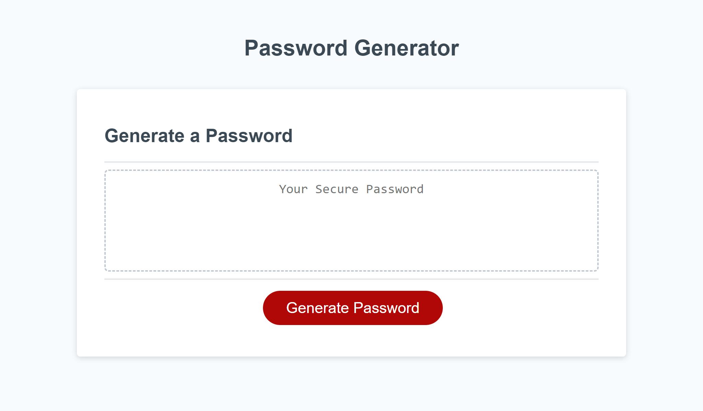

#  Password Generator modified from starter code

## A fully functional password generator that applies specific criteria
This project started off with a starter code for HTML & CSS but the Javascript was untapped, I went ahead and added specific event listeners that call functions on the click of the generate button, which brings the user through specific prompt that allow the user to create a random password depending on how they answer the prompts, also creating a variable to remember how the user answered the prompt to generate a password while still meeting password criteria!

* When generate button is clicked user is given a new secure password
* When generate button is clicked user is prompted through a series of questions to meet password criteria
* User selects the criteria length of a password, as long as its longer than 8 characters and less than 128 characters, if else user will gett alert
* User is prompted to confirm whether or not to include lowercase, uppercase, numeric, and/or special characters
*   User input is validated and a password is generated that matches the selected criteria
* User's password is displayed in a the box written on the page

## visual

## Installation
since this is not my code i would not recomend to just take this code for personal use however, you can refernce certain steps i took into making this project successful & apply them in your unique way on a masterpiece you want a password generater on! 
I used VSCode to create this code but I feel all coding platforms are similar, so do what is convienent for you

## Review

* The URL of the deployed application- https://tyythedeveloper33.github.io/03-PasswordGen/

* The URL of the GitHub repository-https://github.com/Tyythedeveloper33/03-PasswordGen

## credits 
this project started off with starter code with Html & Css it was not my code I dont own rights to the starter code